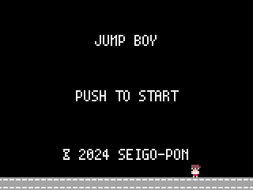
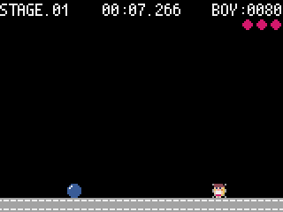

# jumpboy

## Overviews
- jumpboyは、pyxelライブラリを用いて作成された2Dゲームです。
- ジャンルはアクションゲームです。
- PCではキーボード、スマホではタッチのみで操作します。

## Environments
### Software language
- Python 3.12

### Libraries
- pyxel

## Assets
### Fonts
- [PixelMplus](https://itouhiro.hatenablog.com/entry/20130602/font) に掲載されているフォントを使用しています。
  - TTFファイルをBDFファイルに変換しています。

### Sound effects
- [8bit_taste_game_se](https://booth.pm/ja/items/2576189) に掲載されている効果音を使用しています。

### BGMs
- [8bit-bgm-generator](https://github.com/shiromofufactory/8bit-bgm-generator?tab=readme-ov-file) を用いて作成したBGMを使用しています。

## Getting started
```bash
# Install libraries.
pip install -r requirement.txt

# Copy env file.
cp jumpboy/env.sample.py jumpboy/env.py

# Start game.
pyxel run jumpboy/app.py
```

## Edit assets
```bash
# Edit pyxel assets.
pyxel edit jumpboy/assets/jumpboy.pyxres
```

## Build packages
```bash
# Remove temporary folder.
rm -rf jumpboy/snapshot

# Build.
pyxel package jumpboy jumpboy/app.py

# Play game.
pyxel play jumpboy.pyxapp
```

## Game rules
### Input keys
|Event|PC|スマホ|
|--|--|--|
|OK|ENTERキー|タッチ|
|CANCEL|SPACEキー|なし|

### Manual
1. タイトル画面で `OK` するとゲームを開始します。  

1. ゲームはステージごとにプレイします。  

1. プレイが開始すると時間のカウントダウンが開始し、ボールが射出され、プレーヤーに迫ってきます。`OK` するとプレーヤーがジャンプしてボールを避けられます。ボールを避けて、ボールが端まで到達すると得点を取得できます。  

1. `CANCEL` するとプレイが中断します。`OK` か `CANCEL` で再開します。  

1. プレーヤーがジャンプ降下中にボールにヒットすると、ボールを破壊できます。ボールを破壊するとより多くの得点を取得できます。  

1. それ以外でプレーヤーがボールにヒットするとダメージを受けます。3回ダメージを受けるとゲームオーバーです。  

1. タイムアップまでボールを避け続ければステージクリアです。がんばって全てのステージクリアを目指しましょう。  


## License
- GNU General Public License (GPL)
